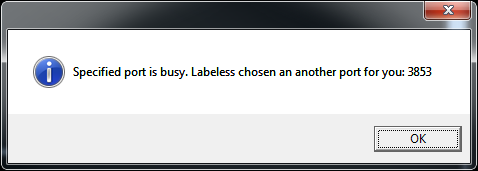
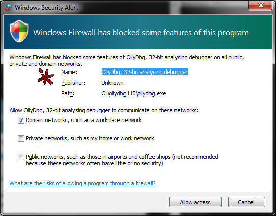

Contributed By Check Point Software Technologies LTD.

[](https://pypi.org/project/labeless)
[](https://ci.appveyor.com/project/a1ext/labeless)
[](https://github.com/a1ext/labeless/releases)
[](https://t.me/labe1ess)
[](https://x.com/a14xt)
[](https://www.patreon.com/a1ext)


Features
========

## 1. Seamless synchronization of labels, function names, comments and global variables (w/wo demangling)

* Synchronization modes
    * On demand
    * On rename (update on-the-fly)
* Supports image base-independent synchronization

## 2. Dynamic dumping of debugged process memory regions
It can be useful in the following cases:

* When debugged process has extracted/temporary/injected module which doesn't appear in modules list
* When it doesn't have a valid PE header
* When it has corrupted import table, etc.
* When it contains unpacked memory regions inside a binary, you can easily merge these new memory regions with the ones that are already present in your database
* When reconstructing chain of memory chunks which are used by malware (and not only, if you know what we mean) so that the picture of its behaviour is complete

## 3. Python scripting

We support the following list of debug backends for now:

* [OllyDbg 1.10](http://www.ollydbg.de/)
* DeFixed 1.10 (FOFF's team mod)
* [OllyDbg 2.01](http://www.ollydbg.de/)
* [x64dbg](https://github.com/x64dbg/x64dbg) (x32, x64)

Overview
========

Labeless is a multipurpose IDA Pro plugin system for **labels/comments synchronization with a debug backend, with complex memory dumping and interactive Python scripting capabilities**.
It consists of two parts: IDA plugin and debug backend's plugin.

Labeless significantly reduces time that researcher spends on transferring already reversed/documented code information from IDA (static) to debugger (dynamic). It saves time, preventing from doing the same job twice. Also, you can document and add data to the IDB on the fly and your changes will be automatically propagated to debug backend, even if you will restart the virtual machine or instance of debug backend will crash. So, you will never lose your research.

This solution is highly upgradable. You can implement any helper scripts in Python on debug backend's side and then just call them from IDA with one line of code, parsing the results and automatically propagating changes to IDB.

**We can take that memory region** and put it in the IDB, fixing imports 'on-the-fly', using debug backend's functionality. No more need in ImpRec or BinScylla, searching for the regions in memory that contain the real IAT, because we get that information dynamically from the debugged process itself.

As a result we have a lot of memory regions that may represent even different modules (if the unpacking process if multistage) with valid references between them, which gives us a possibility to build a full control flow graph of the executable. Basically, we will end up with one big IDB, containing all the info on the specific case.

## Virus Bulletin 2015

* [Presentation](https://www.youtube.com/watch?v=bMQlu-lL6oY)
* [Slides](https://github.com/a1ext/labeless/blob/master/vb2015_presentation/vb2015_labeless.pptx)
* Dumping multiple injections into a single database video on [YouTube](https://youtu.be/M5K5Ldaq284)
* Python scripting video on [YouTube](https://youtu.be/SkcM8Hz2dT4)
* Basic labels sync video on [YouTube](https://youtu.be/iqipmqE2Znk)

## Videos
* [Labeless setup on Win10 x64 (with x64dbg)](https://youtu.be/r5JsDk1SYoM)
* [Resolving APIs dynamically with Labeless & OllyDbg2](https://youtu.be/Dv8YlzXJ5x8)
* [Resolving APIs dynamically with Labeless & x64dbg](https://youtu.be/hMWuWVRkpB0)

Installation
============
## Use of precompiled binaries (release version)
### Debug-backend setup:
If you want to use both x86 and x86_64 targets, then you should do the following steps for each python distro.

* Set up Python 3.10 (x86/x86_64) into separate folders like `c:\Python310` and `c:\Python310x64` for 32 and 64 bit accordingly
The current build's debugger plugins are linked with **Python 3.10**! To make it work for you, it requires to install same version at least Major one to allow debugger plugins to load properly. When installing you can choose the following options I usually chose for myself:
- [x] install python for all users
- simple folder naming in the C: drive root, like `C:\Python310`
- [x] add python home to `%PATH%` (checkbox during its setup), yes you can add both 32 and 64-bit of python's to `%PATH%`,
if you want the 32-bit one to be the main one, just change the order of path entries in the `%PATH%` in system setttings.

Sidenote:
I'm trying to keep it as fresh as possible, but it takes my time to maintain.
In case you want to use your version of python other than Python 3.10, you might copy your Python X's `includes` and `libs` to corresponding
folder in `3rdparty\Python310\` / `3rdparty\Python310x64\` (take a look at existing files to understand how to update)
and re-build all needed plugins.

* do `pip install -U labeless` and that's it (if your machine has Internet). Pay attention, to the python you are invoking, to install it to proper location.
* otherwise (if you don't have Internet there) Copy the release bundle or just a `deploy` folder to target machine, where you want to use a debugger backend and do:
```bat
cd labeless_release_full_1.1.7.0\deploy
c:\Python310\python.exe -m pip install .\protobuf-3.20.3-py2.py3-none-any.whl
c:\Python310\python.exe -m pip install .\labeless-1.1.7.0-py2.py3-none-any.whl
```

**Note**: If you have already used Labeless before and you want to update it, don't forget to reinstall python module each time you have new release

* Configure your debugger backend: set up `plugins` directory

## Configuring of your IDA PRO:
Labeless supports **Windows**,  **Linux** and **MacOS Arm64** IDA PRO. Labeless handles only PE/AMD64 binaries. Labeless requires **IDAPython** plugin `idapython3.{dll,so,dylib}` (it ships with IDA PRO, but make sure it works well).

There are plugins:
```
IDA[XX]\plugins\labeless_ida_xx.{dll,so} - for IDA for Windows, 32-bit targets
IDA[XX]\plugins\labeless_ida_xx_64.{dll,so,dylib} - for IDA for Windows (dll), Linux (so) and MacOS (dylib), 64-bit targets, starting from IDA 9 this will be the only needed to handle both 32 and 64 bit targets
```

Copy Labeless plugins to your IDA's `plugins` directory, for example `c:\IDA90rc1\plugins`


## Configuring of debug backends

### 1. OllyDbg 1.10
You may find prepared debugger in the following directory `OllyDbg110`. (Note!: Don't forget to set up debugger's `plugins` directory).

### 2. DeFixed 1.10 (FOFF's team mod)
Copy `DeFixed110\plugins\labeless_olly_foff.dll` to DeFixed `plugins` directory (Note!: Don't forget to set up debugger's `plugins` directory)

### 3. OllyDbg 2.01
You may find prepared debugger in the following directory `OllyDbg201`. (Note!: Don't forget to set up debugger's `plugins` directory).

### 4. x64dbg (x32,x64)
You may find prepared debugger in the following directory `x64dbg`.


# Checking if everything works
 * Start debug backend (debugger) and check for _Labeless_ item presence in the _Plugins_ menu. If there is any problem, then check Olly's log window for details. Open the log window and check for `LL: ok, binded at <IP>:<PORT>` message, its presence means that debug backend-side plugin is initialized successfully. Note: if you start many debuggers, you may see that the following message appears



Also, you may see the firewall alert



If you want to access the debug backend from another computer, you should allow the backend to listen by this dialog or manually.

 * Start working with existing IDA database or use `Labeless` -> `Load stub database...` from the menu
 * Open Labeless settings dialog using any of the following actions:
    * menu `Edit` -> `Plugins` -> `Labeless`
    * main menu `Labeless` -> `Settings...`
    * hotkey `Alt+Shift+E`
 * Enter **IP address** and **port** of the guest machine (where debug backend is set up), then click on '_Test connection'_ button
 * If IDA displays the message `Successfully connected!`, then configuration is done correctly.


## Development

* Set up Python 3.10 (x86/x86_64)
* protobuf 3.20.3 (already shipped, but if you want to build for Linix or MacOS you need to compile it, see `./3rdparty/protobuf-3.20.3`)
* Visual Studio 2015 + Qt 5.4.1 to build IDA's 6.9 and debug backend plugins. You should build Qt 5.4.1 from sources. Do the following steps to do that:
    * Download sources of Qt 5.4.1 from  [http://download.qt.io/official_releases/qt/5.4/5.4.1/single/](http://download.qt.io/official_releases/qt/5.4/5.4.1/single/qt-everywhere-opensource-src-5.4.1.7z)
    * Check [this article](http://doc.qt.io/qt-5/windows-requirements.html) out to set up Qt 5 requirements
    * Check the [Hex blog](http://www.hexblog.com/?p=969) about compiling Qt 5.4.1, grab the patch and apply it on Qt5 root dir. Then compile Qt 5
    * Set up [Qt VS-Addin](http://download.qt.io/official_releases/vsaddin/qt-vs-addin-1.2.5.exe)
* Visual Studio 2022 + [IDA SDK](https://github.com/HexRaysSA/ida-sdk) to build IDA's 9.2+ plugin. Do the following steps to do that:
    * Build IDA SDK [with CMake and Qt6 support](https://github.com/HexRaysSA/ida-sdk?tab=readme-ov-file#building-with-cmake). No separte Qt patches are required for this SDK version.
    * Set up more recent version of [Qt VS-Addin](https://download.qt.io/official_releases/vsaddin/3.4.1/).
    * Direct plugin project to use Qt6 from the IDA SDK ```src\build\qt-install``` folder.


# How to use
 * If you want to enable synchronization of labels (names) and comments from IDA to Olly you should check '_Enable labels & comments sync_' in Labeless settings dialog in IDA. There is one required field called '_Remote module base_', which should be set to the current module base of the analyzed application. You can find out that information in the debugger
 * Select needed features, like _Demangle name_, _Local labels_, _Non-code names_
 * Select comments synchronization type:
    * \<Disabled\>
    * Non-repeatable
    * Repeatable
    * All

Repeatable - are comments, which IDA shows in any referenced place.

 * If you want to sync labels right now - press '_Sync now_' button. Labeless will sync all found names in your IDB with Olly. Settings dialog will be automatically closed, while saving all settings
 * Also, you may use `Labeless` -> `Sync labels now` from IDA's main menu
 * If you want to customize settings for IDADump engine, do it in the '_IDADump_' tab.
 * To save changed settings, click on '_Save & Close_'

# Things automatically performed in the background
 * If you enabled '_Enable labels & comments sync_' option, then Labeless will automatically synchronize all the data on any rename operation in IDA

* Q: Labeless for x64dbg x32 is works, but x64 doesn't. Why?
* A: Please, recheck that you have installed protobuf and 'labeless' module for Python x64

# Download
* [Download latest release of Labeless](https://github.com/a1ext/labeless/releases/latest)

# Credits
* **Axel Souchet** aka [0vercl0k](https://github.com/0vercl0k)
* **Duncan Ogilvie** aka [mrexodia](https://github.com/mrexodia)
* **Alexey Bukhteyev**
* [**Bohdan Melnykov**](https://github.com/mbv06)
